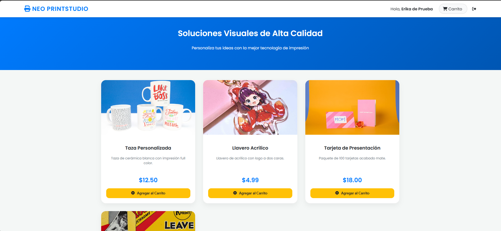
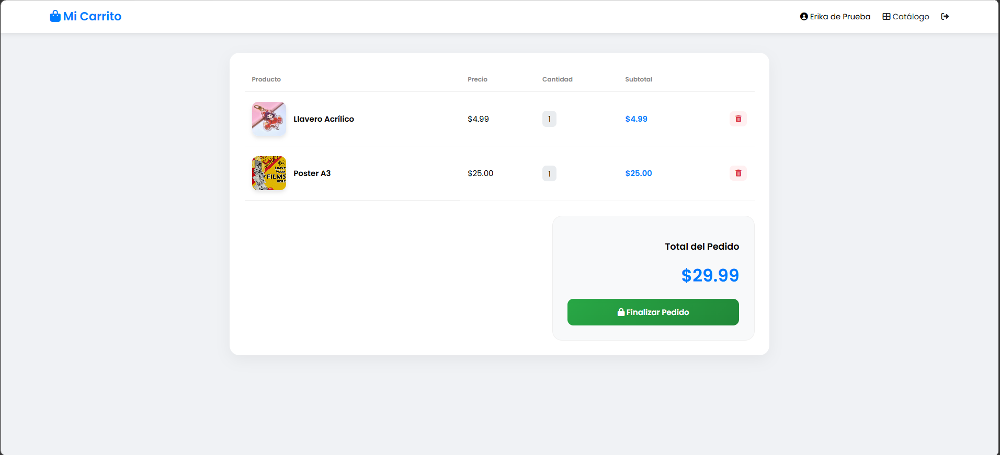

# 🎨 Neo PrintStudio - Sistema de Gestión E-commerce (MVC)

**Neo PrintStudio** es una solución web integral diseñada para la comercialización de artículos de moda urbana y servicios de impresión personalizada (Mugs, llaveros, posters, tarjetas). El proyecto se fundamenta en la arquitectura **Modelo-Vista-Controlador (MVC)**, asegurando un sistema modular, escalable y con una separación clara de responsabilidades técnicas.

---

## 🛠️ Especificaciones del Entorno de Desarrollo

Este proyecto ha sido desarrollado y probado bajo el siguiente stack tecnológico:

* **IDE**: NetBeans 20.
* **Lenguaje**: Java 17 (Jakarta EE).
* **Servidor de Aplicaciones**: Apache Tomcat 9.0.
* **Motor de Base de Datos**: Microsoft SQL Server Management Studio (SSMS).
* **Gestión de Dependencias**: Maven (utilizando drivers JDBC para SQL Server).
* **Frontend**: JSP (JavaServer Pages), HTML5 y CSS3 con diseño responsivo.

---

## 🚀 Funcionalidades Implementadas

* **Autenticación de Usuarios**: Sistema de Login seguro que valida credenciales contra la base de datos y gestiona sesiones activas mediante `HttpSession`.
* **Catálogo Dinámico**: Renderización de productos en tiempo real consumiendo datos desde SQL Server, incluyendo descripción, precios e imágenes.
* **Carrito de Compras**: Lógica de negocio para agregar artículos, calcular subtotales y gestionar la persistencia de los ítems seleccionados.
* **Arquitectura Robusta**: Implementación de patrones **DAO (Data Access Object)** para encapsular la lógica de acceso a datos y **Servlets** para el control de peticiones HTTP.

---

## 📂 Estructura Técnica del Proyecto

La organización del código sigue los estándares de la industria para proyectos Java Web:

* **`Web Pages`**: Contiene la interfaz de usuario (`catalogo.jsp`, `carrito.jsp`, `login.jsp`) y recursos visuales.
* **`Source Packages`**:
    * `controlador`: Servlets que orquestan la navegación y las acciones del usuario.
    * `dao`: Clases encargadas de las consultas SQL (`ProductoDAO`, `UsuarioDAO`).
    * `modelo`: Clases entidad que representan los datos del sistema (`Producto`, `Usuario`).
    * `util`: Configuración de la conexión JDBC (`ConexionBD.java`).

---

## 🗄️ Diseño de Base de Datos (SQL Server)

El sistema utiliza tres tablas principales con integridad referencial:

1.  **`dbo.usuario`**: Almacena perfiles, correos y credenciales.
2.  **`dbo.producto`**: Contiene el inventario, precios y rutas de imágenes.
3.  **`dbo.carrito_item`**: Tabla intermedia que vincula los productos elegidos con el usuario activo.

---

## 📸 Capturas del Funcionamiento

### 🔐 Inicio de Sesión
Aquí los usuarios registrados pueden acceder a su cuenta para gestionar sus compras.

---

### 👕 Catálogo de Productos
Interfaz donde se muestran las prendas de estilo urbano disponibles (Mugs, Gorras, etc.).

---

### 🛒 Carrito de Compras
Sección donde el usuario puede ver los productos seleccionados, ajustar cantidades y ver el total.

---

## ⚙️ Guía de Instalación y Despliegue

1.  **Base de Datos**:
    * Ejecute el script `SQLQuery_AppImpresiones.sql` en su instancia de SQL Server para generar la estructura de tablas.
    * Asegúrese de que el servicio de SQL Server permita conexiones TCP/IP por el puerto 1433.
2.  **Configuración de Conexión**:
    * Actualice el archivo `ConexionBD.java` con su nombre de usuario y contraseña de base de datos local.
3.  **Compilación**:
    * Desde NetBeans, ejecute **"Clean and Build"** para descargar las dependencias de Maven.
4.  **Ejecución**:
    * Despliegue el proyecto sobre **Apache Tomcat 9.0**. El sistema abrirá automáticamente el navegador en la raíz del proyecto.

---

## 👤 Información del Autor
* **Erika Ramirez** @erikaramirezm0221-netizen - Estudiante de Desarrollo de Software y Aplicativos Móviles.
